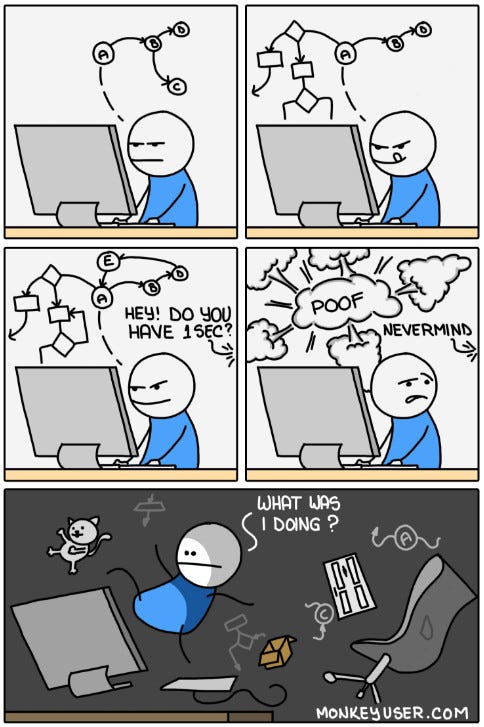
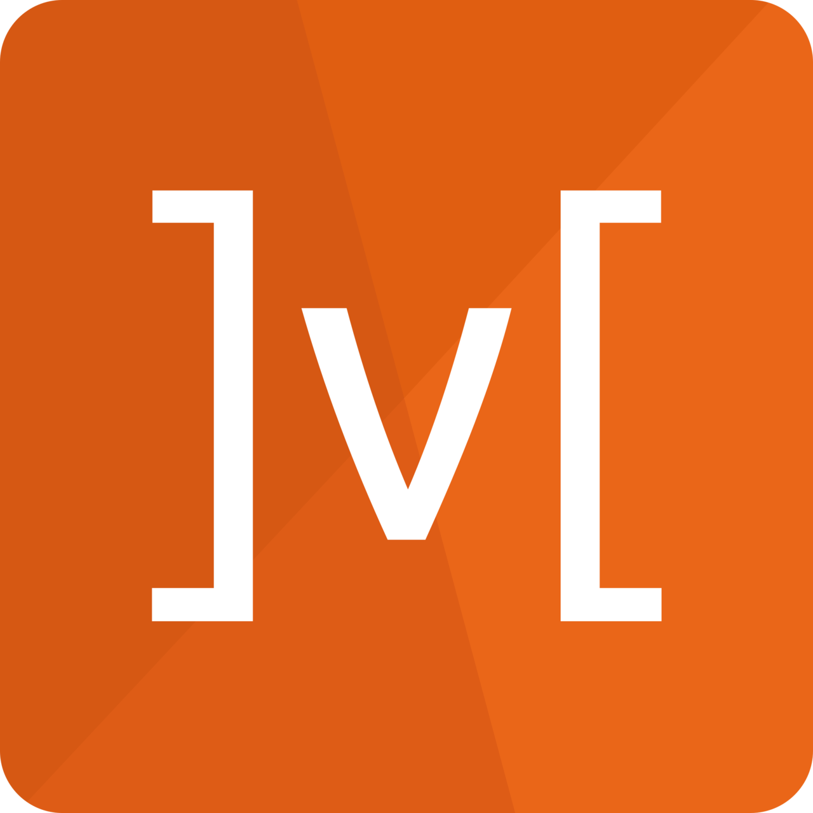
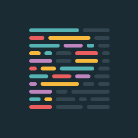

<h1> Hey! Nice to see you.</h1>

 

### 
Welcome to my page!   I'm Giorgos, Fullstack Developer from  <b>Greece</b>, currently living in  <b>Aarhus, Denmark</b>. 

### <h1>My tech stack which I work with</h1>

  
  
  
  
  
  
  
  
  
  
   
  
  
  
  
  
  
  
  

### Work Experience

In the overview below you will find my most recent work experience:

**React Developer (FE Dev)** \
[**Nina Global**] • Fulltime \
Languages & Technologies: `Typescript`, `React`, `Mobx`, `GraphQl`, `EmotionJs` \
 

### <h3> :bulb: Desire for Mastery :bulb:</h3>

  <h3>:speaking_head:As a self-taught developer, I am constantly driven by my curiosity and desire to understand how things work :books:. I am hungry to learn and passionate about developing my skills and knowledge in coding :keyboard: . I believe that being good at something is not enough, and I am always striving to improve and become the best I can be. I am committed to continuous learning and growth, and I am excited to take on new challenges and opportunities to push myself further.:fire: </h3>

### <h1>Feel free to contact me to collaborate!:slightly_smiling_face:</h1>

### <h1>Where to find me</h1>

&emsp; &emsp; &emsp; &emsp;

<!--
**GeorgeNonis/GeorgeNonis** is a ✨ _special_ ✨ repository because its `README.md` (this file) appears on your GitHub profile.

Here are some ideas to get you started:

- 🔭 I’m currently working on ...
- 🌱 I’m currently learning ...
- 👯 I’m looking to collaborate on ...
- 🤔 I’m looking for help with ...
- 💬 Ask me about ...
- 📫 How to reach me: ...
- 😄 Pronouns: ...
- ⚡ Fun fact: ...
-->
