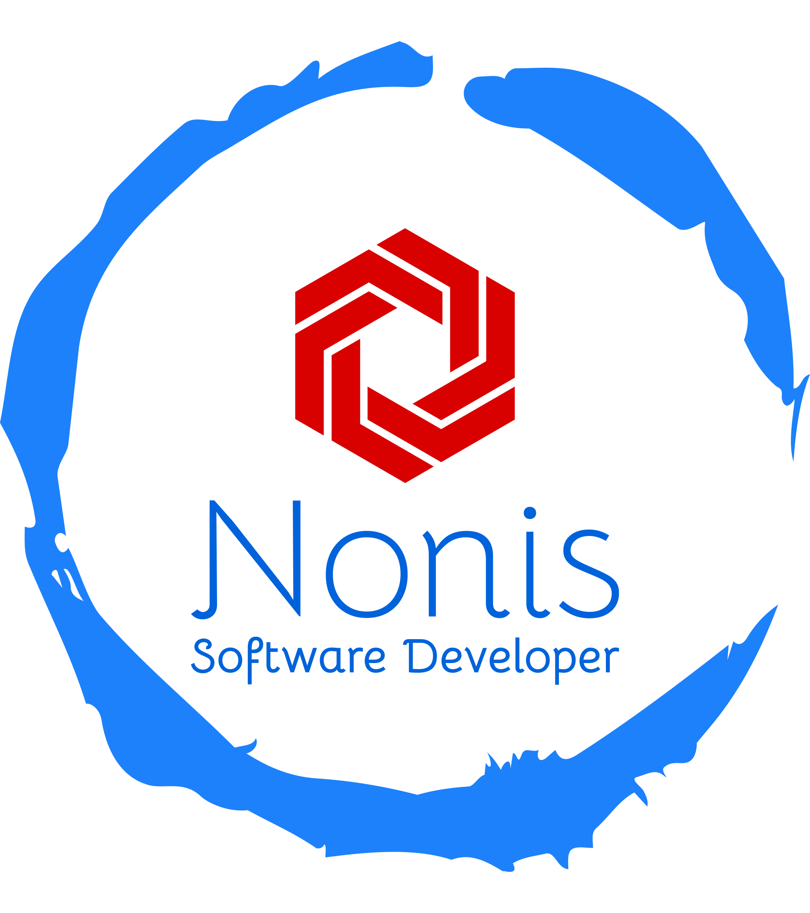

<h1> Hey! Nice to see you.</h1>

 

### 
Welcome to my page!   I'm Giorgos, Fullstack Developer from  <b>Greece</b>, currently living in  <b>Aarhus, Denmark</b>. 

### <h1>My tech stack which I work with</h1>

  
  
  
  
  
  
  
  
  
  
  
   
  
  
  
  
  
  
  
  
  

### <h3> 💡 Desire for Mastery 💡</h3>

  <h3> 🗣️ I am constantly driven by my curiosity and desire to understand how things work 🛠️. I am hungry to learn and passionate about developing my skills and knowledge in coding  ⌨️. I believe that being good at something is not enough, and I am always striving to improve and become the best I can be. I am committed to continuous learning and growth, and I am excited to take on new challenges and opportunities to push myself further. 🎖️🔥 </h3>

### <h1>Feel free to contact me to collaborate</h1>

### <h1>Where to find me</h1>

&emsp; &emsp; &emsp; &emsp;

<!--
**GeorgeNonis/GeorgeNonis** is a ✨ _special_ ✨ repository because its `README.md` (this file) appears on your GitHub profile.

Here are some ideas to get you started:

- 🔭 I’m currently working on ...
- 🌱 I’m currently learning ...
- 👯 I’m looking to collaborate on ...
- 🤔 I’m looking for help with ...
- 💬 Ask me about ...
- 📫 How to reach me: ...
- 😄 Pronouns: ...
- ⚡ Fun fact: ...
-->
